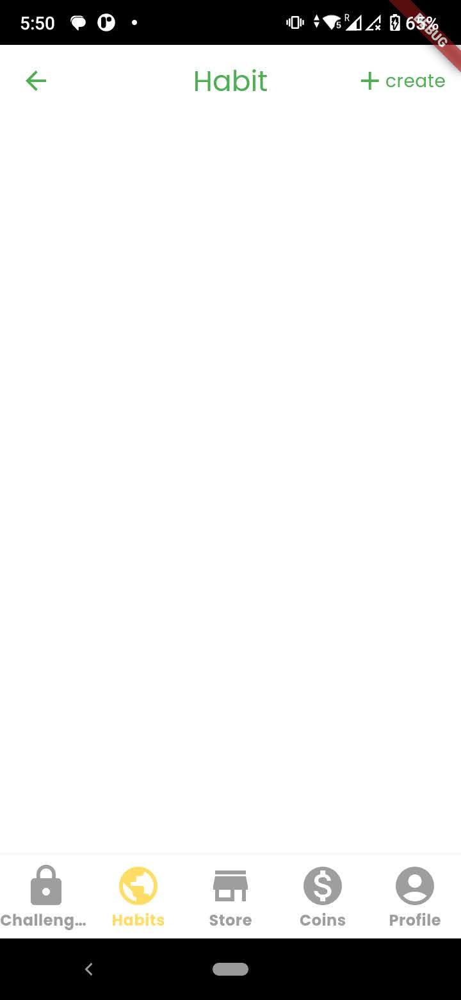
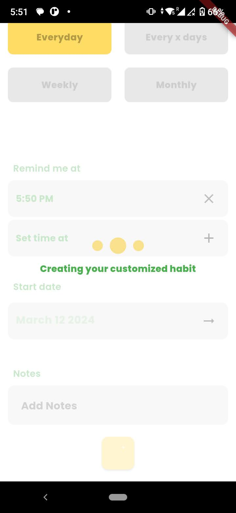
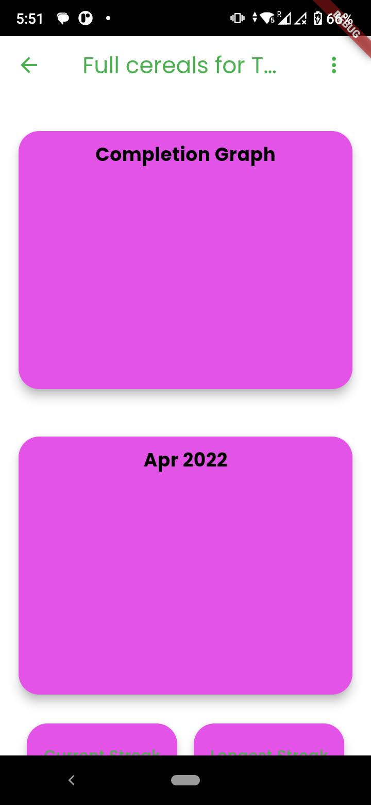
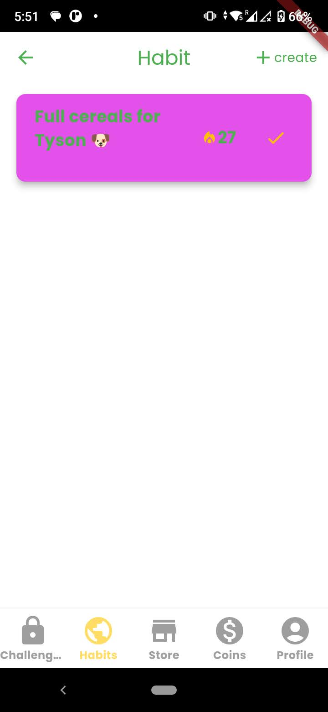
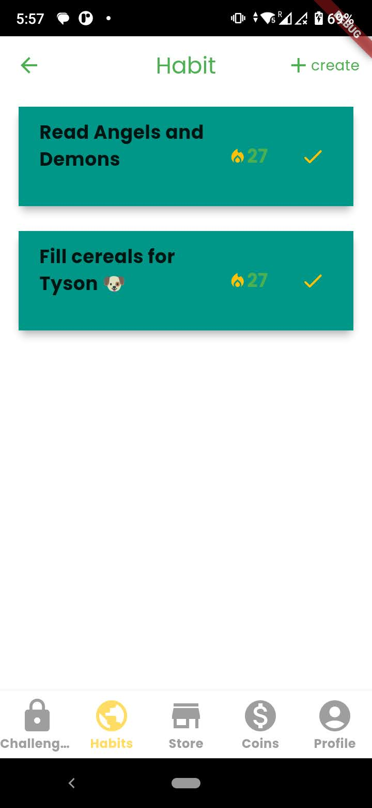
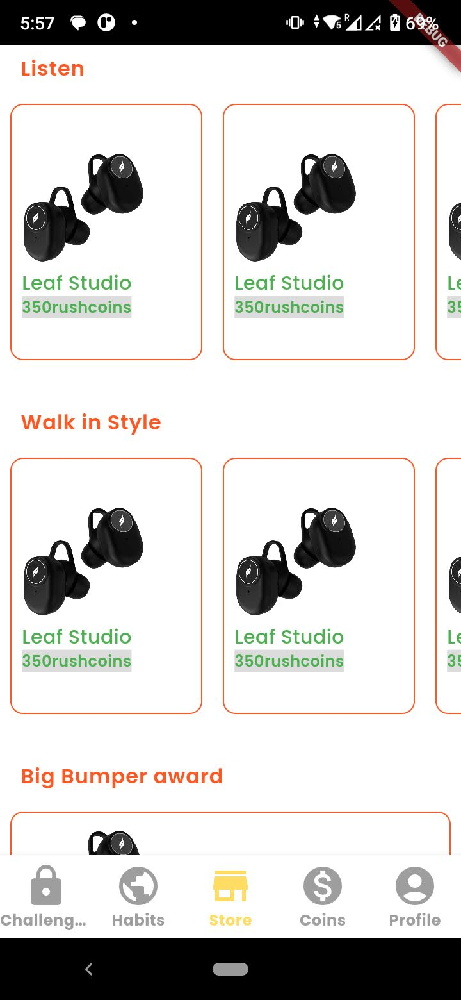
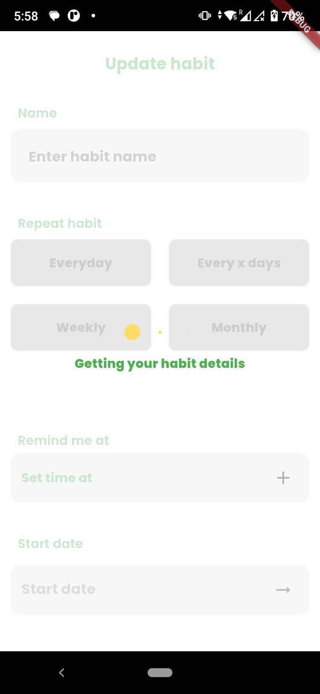

# HabitRush

**HabitRush** is a Flutter-based application designed to help users build and maintain positive habits. Featuring a unique virtual currency called RushCoins, the app rewards users for their progress and keeps them motivated on their journey to habit formation.

## Features

- **Habit Tracking:** Easily track and manage your habits.
- **RushCoins:** Earn and use RushCoins to unlock rewards and stay motivated.
- **Engaging Interface:** Built with Flutter for a smooth and interactive user experience.
- **Progress Insights:** Monitor your progress and stay on top of your habit goals.

## Screenshots

Here are some screenshots of the HabitRush app:

        

## Getting Started

To get started with HabitRush:

1. **Clone the Repository:**

   ```bash
   git clone https://github.com/ankitmhatre/habitrush.git
